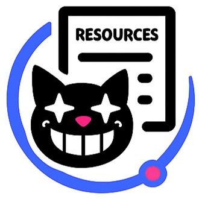

    
    <b>Context Guardian & Enricher</b>

Intelligently guard your AI conversations by ensuring responses stay within your knowledge base while enriching messages with source links and UTM tracking!

## Description

**Context Guardian & Enricher** is a plugin for Cheshire Cat AI that ensures that the AI only responds to queries that have relevant context in the knowledge base, while automatically enriching responses with source citations and UTM tracking for analytics.

The plugin provides five core functionalities:
1. **Context Guardian**: Rejects queries that have no relevant context in the declarative memory
2. **Source Enricher**: Automatically appends sources to responses with optional UTM tracking to ALL the links
3. **Conversation History Context**: Uses recent conversation history to improve memory search accuracy
4. **Panic Button**: Emergency mode that always returns a predefined message regardless of context
5. **Time Awareness**: Adds current timestamp to user messages for temporal context

## Features

- Automatically rejects out-of-context queries that have no relevant information in the knowledge base and answer with a predefined message
- **Enhanced Memory Search**: Combines current message with recent conversation history for better context understanding (e.g., when user says "what about X" followed by "explain better", the system searches memory using both messages together)
- Bypasse all the checks when users are in active form sessions and does not append any source when the `<no_sources>` tag is found in the message
- Emergency override that always returns a predefined maintenance message (Panic Button)
- Append relevant source URLs and titles to the `message.sources` parameter as a list `(url, title)`
- Customizable UTM parameters to all outgoing links for analytics tracking to all URLs in the `message.text` other than the sources
- Append current timestamp to user messages

## Requirements

- Cheshire Cat AI
- Context Guardian & Enricher plugin enabled in Cheshire Cat AI

## Settings

- **`double_pass`**: *(Boolean, default: False)* - It combines user input with generated response for more precise source selection. When enabled, only sources that appear in both the initial query results and the post-response query are included.

- **`default_message`**: *(Text Area, default: "Sorry, I can't help you. To answer adequately: • Write short, complete sentences • Express one request at a time")* - The message returned when no relevant context is found in the knowledge base.

- **`min_query_length`**: *(int, default: 10)* - Minimum number of characters a query must have to be accepted for processing.

- **`max_query_len`**: *(int, default: 500)* - Maximum number of characters a query can have to be accepted for processing. Set to 0 to disable maximum length check. Queries exceeding this length will receive the default rejection message.

- **`panic_button_enabled`**: *(Boolean, default: False)* - Enable panic button mode that always returns the panic button text regardless of context or available knowledge. When enabled, takes priority over all other functionality.

- **`panic_button_text`**: *(Text Area, default: "Sorry, I'm under maintenance right now. Please try again later.")* - The message returned when panic button mode is enabled.

- **`utm_source`**: *(String, default: "")* - UTM source parameter to add to all outgoing links for tracking purposes. Leave empty to disable UTM tracking entirely. This parameter is added to both source citations in `message.sources` and any URL generated by the LLM in `message.text`.

- **`use_conversation_history`**: *(Boolean, default: True)* - Include recent conversation history when searching memories for better context understanding. When enabled, combines the current message with previous messages to provide richer context for memory retrieval.

- **`conversation_history_length`**: *(Integer, default: 3)* - Number of previous messages to include in memory search context. Set to 0 to disable conversation history. Range: 0-10 messages. This helps the system understand contextual queries like "explain better" or "what about that topic" by referencing previous conversation turns.

- **`max_query_length`**: *(Integer, default: 1000)* - Maximum length of the enhanced query string (including conversation history) to avoid embedding model limits. Range: 100-5000 characters. If the combined query exceeds this length, it will be truncated from the beginning.

## Technical Details

### Hooks Used

- **`cat_recall_query`**: Enhances memory search queries by combining current message with conversation history for better contextual understanding
- **`fast_reply`**: Intercepts queries early to check for relevant context before engaging the LLM
- **`before_cat_reads_message`**: Adds current timestamp to user messages
- **`before_cat_sends_message`**: Enriches outgoing messages with sources and UTM tracking

---

Author: OpenCity Labs

LinkedIn: https://www.linkedin.com/company/opencity-italia/